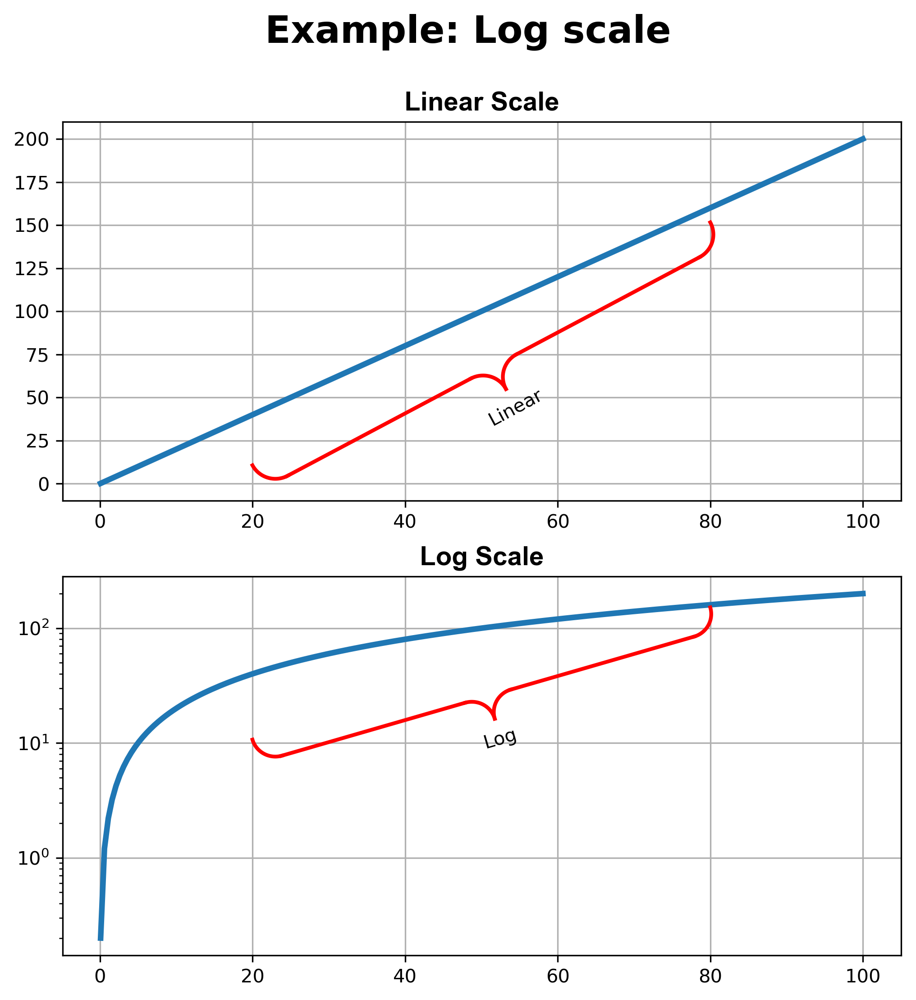

# Plot curly brace with matplotlib

The purpose of this project is to allow easy plotting of curly brace between two points when using matplotlib.

This feature is not built into matplotlib (also, not MATLAB, but there is a very good implementation on File Exchange), and thus the motivation. The author has found some previous implementations, but none would do what the author would like to do, i.e., give the function the xs and ys of two points of
the axes and plot a curly bracket with text annotation at the summit of the bracket. Therefore, the author decided to write one.

The implementation here is based largely on the implementation by [Pål Næverlid Sævik](https://uk.mathworks.com/matlabcentral/fileexchange/38716-curly-brace-annotation) for MATLAB (can be found on File Exchange). Some modifications are done for Python purposes. Some addition features have been implemented, e.g., allow text annotation, negative log (for 'symlog' scale in matplotlib).

This project is built with Python 3.7.1, matplolib 2.2.3 and numpy 1.15.4.

Tested on Windows 7.

**The full documentation is in 'build/html/index.html'**

The following is an example of plotting two curly brackets to annotate a sine wave.


## Main features

* **Allows intuitive plotting of a curly bracket between two points within the given axes of the given figure** 
* **Allows text annotation to be placed at the summit of the bracket with the same rotation as the bracket**
* **The height of the bracket can be controlled**
* **Accepts line settings for the bracket lines (same as matplotlib via named parameters, e.g., line width, line colour, etc.)**
* **Accepts font settings of the annotating text (same as matplotlib, just give a fontdict)**
* **Works with linear axes and log axes**
* **Transformation between axes coordinates and screen coordinates can be turned on or off**

## Prerequisites

* **Python 3.5+**
* **maplotlib**
* **numpy**

## Version

**1.0.1**

## Example

### Annotating sine waves

<!--  -->


```python
import matplotlib.pyplot as plt
import numpy as np
from curlyBrace import curlyBrace
import os

# save fig control
bool_savefig = False

# figure size and dpi
dbl_width   = 800.0
dbl_height  = 800.0
dbl_dpi     = 100.0

# line width and colour for the sine wave
lw = 2
color='royalblue'

# plot the sine wave
theta = np.linspace(0.0, 2.0 * np.pi, 101)

x = theta
y = np.sin(theta) * 8.0

fig, axes = plt.subplots(2, 1 , figsize=(dbl_width / dbl_dpi, dbl_width / dbl_dpi), dpi=dbl_dpi)

# fontdict for axis title
font = {'family': 'Arial',
        'color':  'k',
        'weight': 'bold',
        'style': 'normal',
        'size': 20,
        }

# aixs title string
str_title = [None, None]

str_title[0] = 'Example: Different axes scales, auto scale on'
str_title[1] = 'Example: Different axes scales, auto scale off'

axes[0].set_title(str_title[0], fontdict=font)
axes[0].plot(x, y, lw=lw, color=color)
axes[0].grid(linestyle='--')
axes[0].set_xlim(xmin=0.0, xmax=2.0*np.pi)

axes[1].set_title(str_title[1], fontdict=font)
axes[1].plot(x, y, lw=lw, color=color)
axes[1].grid(linestyle='--')
axes[1].set_xlim(xmin=0.0, xmax=2.0*np.pi)

# curly bracket 1 start point and end point
p1 = [0.0, 0.0]
p2 = [np.pi, 0.0]

# curly bracket 2 start point and end point
p3 = [np.pi, 0.0]
p4 = [2.0 * np.pi, 0.0]

# fontdict for curly bracket 1 text
font = {'family': 'serif',
        'color':  'k',
        'weight': 'bold',
        'style': 'italic',
        'size': 20,
        }

# curly brack text
str_text = '$\pi$'

# coefficient for curly bracket 1
k_r1 = 0.05

# coefficient for curly bracket 2
k_r2 = 0.1

# clockwise, need to swap the start point and end point
curlyBrace(fig, axes[0], p2, p1, k_r1, bool_auto=True, str_text=str_text, color='r', lw=2, int_line_num=1, fontdict=font)

# anti-clockwise, no need to swap the start point and end point
curlyBrace(fig, axes[0], p3, p4, k_r2, bool_auto=True, str_text=str_text, color='darkorange', lw=3, int_line_num=1, fontdict=font)

# clockwise, need to swap the start point and end point
curlyBrace(fig, axes[1], p2, p1, k_r1, bool_auto=False, str_text=str_text, color='m', lw=2, int_line_num=1, fontdict=font)

# anti-clockwise, no need to swap the start point and end point
curlyBrace(fig, axes[1], p3, p4, k_r2, bool_auto=False, str_text=str_text, color='darkgreen', lw=3, int_line_num=1, fontdict=font)

# save fig
if bool_savefig:

    str_filename = os.path.basename(__file__)[:-3] + '.png'

    str_filename = os.path.join(os.getcwd(), str_filename)

    fig.savefig(str_filename, bbox_inches='tight', dpi=300)

else:

    pass

plt.show()
```


### Annotating circles

<!--  -->


### Annotating log scale

<!--  -->


### Annotating ellipses

<!--  -->


### Annotating astroids

<!--  -->


## Contributing

高斯羽 博士 (Dr. Gao, Siyu)